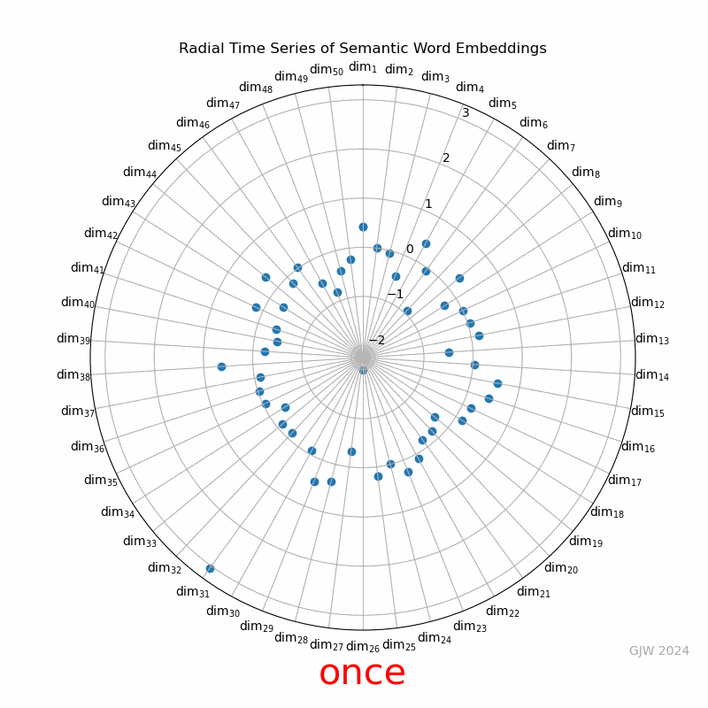

# Radial Visualization of Semantic Embeddings

This repository contains a Jupyter notebook that demonstrates the radial visualization of semantic word embeddings. The visualization is animated to show how word embeddings of a given sentence change over time.

## Overview

This project uses pre-trained GloVe embeddings to create a radial animation of word embeddings. The embeddings are projected onto a polar coordinate system with dimensions as radial axes. The animation updates as the sentence progresses, showing the semantic representation of each word.

## Getting Started

### Prerequisites

- Python 3.6 or higher
- Jupyter Notebook
- Required Python packages: `numpy`, `matplotlib`, `nltk`, `gensim`

### Installation

1. Clone the repository:
   ```bash
   git clone https://github.com/galenwilkerson/Radial-Visualization-of-Semantic-Embeddings.git
   cd Radial-Visualization-of-Semantic-Embeddings
   ```

2. Install the required packages:
   ```bash
   pip install numpy matplotlib nltk gensim requests
   ```

### Usage

1. Run the Jupyter notebook:
   ```bash
   jupyter notebook "Radial Visualization of Semantic Embeddings.ipynb"
   ```

2. Follow the steps in the notebook to preprocess the text, load GloVe embeddings, and create the radial animation.

### Example Output

Below is an example of the radial animation generated by the notebook:



### Code Explanation

- `load_glove_model()`: Loads the GloVe model using Gensim's downloader.
- `preprocess_text(text)`: Tokenizes the input text into sentences and words.
- `extract_embeddings(tokenized_sentences, glove_model)`: Extracts word embeddings from the pre-trained GloVe model for each word in the tokenized sentences.
- `update_plot(num, data, scatter, text_display, words)`: Updates the plot for the animation.
- `create_radial_animation(word_embeddings, words, output_path='radial_animation.gif')`: Creates the radial animation and saves it as a GIF.

## Contributing

Contributions are welcome! Please open an issue or submit a pull request for any improvements or bug fixes.

## License

This project is licensed under the MIT License. See the [LICENSE](LICENSE) file for details.

## Acknowledgments

- [GloVe: Global Vectors for Word Representation](https://nlp.stanford.edu/projects/glove/)
- [Gensim: Topic Modelling for Humans](https://radimrehurek.com/gensim/)
